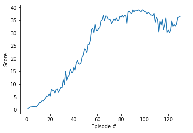

# Report for Continuous_Control

## Learning Algorithm
The report clearly describes the learning algorithm, along with the chosen hyperparameters. It also describes the model architectures for any neural networks.

### Agent 
Agent used The Deep Deterministic Policy Greadient(DDPG) algorithm with Actor-Critic method.

- Step saves the data in Replay memory.
- Act return actions for the given states
- Learn update the policy and value parameters using the given batch of replay experience tuples.
- `Q_targets = r + γ * critic_target(next_state, actor_target(next_state))`
- Compute critic loss and minimize the loss
- use clip_grad_norm method `torch.nn.utils.clip_grad_norm_(self.critic_local.parameters(), 1)`
- Compute actor loss and minimize the loss
- Soft_update use TAU hyperparameter to update the target network based on `
tau*local_param.data + (1.0-tau)*target_param.data`


#### Actor Network
- input a seed to init torch.manual_seed(seed)
- nn.Linear for each layer
- state_size=33 as input nodes
- 128 of nodes in first hidden layer and  use a ReLU activation 
- use BatchNorm1d as a 128 of nodes Normalization layers 
- 128 of nodes in third hidden layer and use a ReLU activation
- action_size=4 as output nodes and use tanh function

```
Actor(
  (fc1): Linear(in_features=33, out_features=128, bias=True)
  (bn1): BatchNorm1d(128, eps=1e-05, momentum=0.1, affine=True, track_running_stats=True)
  (fc2): Linear(in_features=128, out_features=128, bias=True)
  (fc3): Linear(in_features=128, out_features=4, bias=True)
)
```

#### Critic Network
- input a seed to init torch.manual_seed(seed)
- nn.Linear for each layer
- state_size=33 as input nodes
- 128 of nodes in first hidden layer and  use a ReLU activation
- use BatchNorm1d as a 128 of nodes Normalization layers 
- 128 of nodes in third hidden layer and use a ReLU activation
- 1 as output nodes and use tanh function

```
Critic(
  (fcs1): Linear(in_features=33, out_features=128, bias=True)
  (bn1): BatchNorm1d(128, eps=1e-05, momentum=0.1, affine=True, track_running_stats=True)
  (fc2): Linear(in_features=132, out_features=128, bias=True)
  (fc3): Linear(in_features=128, out_features=1, bias=True)
)
```

#### ReplayBuffer
Fixed-size buffer to store experience tuples. It can make the learning method on the data from current experience and past experiences by randomly sampling the stored tuples.

#### Noise 
It used Ornstein-Uhlenbeck process. Update internal state and return it as a noise sample.
`dx = self.theta * (self.mu - x) + self.sigma * np.random.standard_normal(self.size)` and `mu=0., theta=0.15, sigma=0.2`


###  Hyperparameters

- BUFFER_SIZE - replay buffer size
- BATCH_SIZE  - minibatch size
- GAMMA - discount factor
- TAU - for soft update of target parameters
- LR_ACTOR - learning rate of the actor 
- LR_CRITIC - learning rate of the critic 

## Plot of Rewards
A plot of rewards per episode is included to illustrate that the agents get an average score of +0.5 (over 100 consecutive episodes, after taking the maximum over both agents).

- the most quickly to receive an average reward of as least +30

```python
BUFFER_SIZE = int(1e5)  
BATCH_SIZE = 64         
GAMMA = 0.99            
TAU = 1e-3              
LR_ACTOR = 1e-4
LR_CRITIC = 5e-3              

Episode 126	Average Score: 31.16
```

### Runing record

```python
BUFFER_SIZE = int(1e5)  # replay buffer size
BATCH_SIZE = 64       # minibatch size
GAMMA = 0.99            # discount factor
TAU = 1e-3              # for soft update of target parameters
LR_ACTOR = 1e-4         # learning rate of the actor 
LR_CRITIC = 5e-4        # learning rate of the critic
WEIGHT_DECAY =  0       # L2 weight decay

agent = Agent(state_size=33, action_size=4, random_seed=10)
scores = ddpg(n_episodes=500, max_t=2000, print_every=100)
```

    Episode 0	Average Score: 0.50	 Score: 0.50
    Episode 10	Average Score: 1.19	 Score: 2.23
    Episode 20	Average Score: 2.60	 Score: 5.87
    Episode 30	Average Score: 5.26	 Score: 16.46
    Episode 40	Average Score: 9.16	 Score: 27.40
    Episode 50	Average Score: 13.44	 Score: 35.34
    Episode 60	Average Score: 16.89	 Score: 33.36
    Episode 70	Average Score: 19.25	 Score: 35.06
    Episode 80	Average Score: 21.02	 Score: 33.77
    Episode 90	Average Score: 22.41	 Score: 32.77
    Episode 100	Average Score: 23.79	 Score: 32.82
    Episode 110	Average Score: 26.90	 Score: 32.67
    Episode 120	Average Score: 29.82	 Score: 31.67
    Episode 126	Average Score: 31.16	 Score: 35.87
    Average score of 30 achieved


```python
BUFFER_SIZE = int(1e6)  # replay buffer size
BATCH_SIZE = 64       # minibatch size
GAMMA = 0.99            # discount factor
TAU = 1e-3              # for soft update of target parameters
LR_ACTOR = 1e-4         # learning rate of the actor 
LR_CRITIC = 2e-4        # learning rate of the critic
WEIGHT_DECAY =  0       # L2 weight decay

agent = Agent(state_size=33, action_size=4, random_seed=10)
scores = ddpg(n_episodes=500, max_t=2000, print_every=100)
```

    Episode 0	Average Score: 0.37	 Score: 0.37
    Episode 10	Average Score: 1.33	 Score: 2.83
    Episode 20	Average Score: 2.99	 Score: 7.99
    Episode 30	Average Score: 4.64	 Score: 11.72
    Episode 40	Average Score: 6.91	 Score: 15.42
    Episode 50	Average Score: 9.54	 Score: 22.29
    Episode 60	Average Score: 12.87	 Score: 31.83
    Episode 70	Average Score: 16.02	 Score: 35.14
    Episode 80	Average Score: 18.41	 Score: 36.91
    Episode 90	Average Score: 20.49	 Score: 38.29
    Episode 100	Average Score: 22.52	 Score: 38.24
    Episode 110	Average Score: 26.05	 Score: 35.17
    Episode 120	Average Score: 28.82	 Score: 30.14
    Episode 128 Average Score: 31.18 Score: 36.43
    Average score of 30 achieved


```python
import matplotlib.pyplot as plt
%matplotlib inline

fig = plt.figure()
ax = fig.add_subplot(111)
plt.plot(np.arange(1, len(scores)+1), scores)
plt.ylabel('Score')
plt.xlabel('Episode #')
plt.show()
```





```python
agent = Agent(state_size=33, action_size=4, random_seed=10)
actor_dict = torch.load('checkpoint_actor.pth')
critic_dict = torch.load('checkpoint_critic.pth')
agent.actor_local.load_state_dict(actor_dict)
agent.critic_local.load_state_dict(critic_dict)
agent.critic_target.load_state_dict(critic_dict)
agent.actor_local.load_state_dict(actor_dict)
agent.actor_target.load_state_dict(actor_dict)

env_info = env.reset(train_mode=False)[brain_name] # reset the environment
states = env_info.vector_observations           # get the current state
scores_agents = np.zeros(num_agents)    
while True:
    actions = agent.act(states, 0.0)
    env_info = env.step(actions)[brain_name] 
    next_states = env_info.vector_observations
    rewards = env_info.rewards     
    dones = env_info.local_done       
    agent.step(states, actions, rewards, next_states, dones)
    states = next_states
    scores_agents += rewards
    if np.any(dones):
        break 
print(np.mean(scores_agents))
```

    35.1239992149


## Ideas for Future Work

- building networks with different architectures and find a best one for this environment
- try to used different algorithm like PPO, A3C and D4PG
- Hyperparameters maybe no the best one, tuning hyperparameters would get better results.
