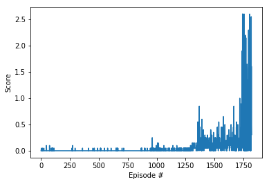

# Report for Collaboration and Competition

## Learning Algorithm
The report clearly describes the learning algorithm, along with the chosen hyperparameters. It also describes the model architectures for any neural networks.

### Agent 
Agent used The Deep Deterministic Policy Greadient(DDPG) algorithm with Actor-Critic method.

- Step saves the data in Replay memory.
- Act return actions for the given states
- Learn update the policy and value parameters using the given batch of replay experience tuples.
- `Q_targets = r + γ * critic_target(next_state, actor_target(next_state))`
- Compute critic loss and minimize the loss
- use clip_grad_norm method `torch.nn.utils.clip_grad_norm_(self.critic_local.parameters(), 1)`
- Compute actor loss and minimize the loss
- Soft_update use TAU hyperparameter to update the target network based on `
tau*local_param.data + (1.0-tau)*target_param.data`


#### Actor Network
- input a seed to init torch.manual_seed(seed)
- nn.Linear for each layer
- state_size=24 as input nodes
- 64 of nodes in first hidden layer and  use a ReLU activation
- 32 of nodes in second hidden layer and use a ReLU activation
- action_size=2 as output nodes and use tanh function

```
Actor(
  (fc1): Linear(in_features=24, out_features=64, bias=True)
  (fc2): Linear(in_features=64, out_features=32, bias=True)
  (fc3): Linear(in_features=32, out_features=2, bias=True)
)
```

#### Critic Network
- input a seed to init torch.manual_seed(seed)
- nn.Linear for each layer
- state_size=24 as input nodes
- 64 of nodes in first hidden layer and  use a ReLU activation
- 32 of nodes in second hidden layer and use a ReLU activation
- 16 of nodes in third hidden layer and use a ReLU activation
- 1 as output nodes and use tanh function

```
Critic(
  (fcs1): Linear(in_features=24, out_features=64, bias=True)
  (fc2): Linear(in_features=66, out_features=32, bias=True)
  (fc3): Linear(in_features=32, out_features=16, bias=True)
  (fc4): Linear(in_features=16, out_features=1, bias=True)
)
```

#### ReplayBuffer
Fixed-size buffer to store experience tuples. It can make the learning method on the data from current experience and past experiences by randomly sampling the stored tuples.

#### Noise 
It used Ornstein-Uhlenbeck process. Update internal state and return it as a noise sample.
`dx = self.theta * (self.mu - x) + self.sigma * np.random.standard_normal(self.size)` and `mu=0., theta=0.15, sigma=0.2`


###  Hyperparameters

- BUFFER_SIZE - replay buffer size
- BATCH_SIZE  - minibatch size
- GAMMA - discount factor
- TAU - for soft update of target parameters
- LR_ACTOR - learning rate of the actor 
- LR_CRITIC - learning rate of the critic 

## Plot of Rewards
A plot of rewards per episode is included to illustrate that the agents get an average score of +0.5 (over 100 consecutive episodes, after taking the maximum over both agents).

- the most quickly to receive an average reward of as least +0.5

```python
BUFFER_SIZE = int(1e6)  
BATCH_SIZE = 1024         
GAMMA = 0.99            
TAU = 1e-3              
LR_ACTOR = 2e-4
LR_CRITIC = 1e-3              

Episode 1819	Average Score: 0.60270  
```

### Runing record

```python
BUFFER_SIZE = int(1e6)  
BATCH_SIZE = 1024         
GAMMA = 0.99            
TAU = 1e-3              
LR_ACTOR = 2e-4
LR_CRITIC = 1e-3 
WEIGHT_DECAY = 0 

agent = Agent(state_size=24, action_size=2, random_seed=3)
scores = ddpg(n_episodes=10000, max_t=20000, print_every=100)

```

```
Episode 0	Average Score: -0.00500
Episode 100	Average Score: 0.00150
Episode 200	Average Score: -0.00400
Episode 300	Average Score: -0.00300
Episode 400	Average Score: -0.00450
Episode 500	Average Score: -0.00300
Episode 600	Average Score: -0.00300
Episode 700	Average Score: -0.00150
Episode 800	Average Score: -0.00450
Episode 900	Average Score: -0.00250
Episode 1000	Average Score: 0.00745
Episode 1100	Average Score: 0.00895
Episode 1200	Average Score: 0.00650
Episode 1300	Average Score: 0.02095
Episode 1400	Average Score: 0.10740
Episode 1500	Average Score: 0.11250
Episode 1600	Average Score: 0.15600
Episode 1700	Average Score: 0.16150
Episode 1800	Average Score: 0.49010
Episode 1819	Average Score: 0.60270
Average score of 0.5 achieved!
```


```python
import matplotlib.pyplot as plt
%matplotlib inline

fig = plt.figure()
ax = fig.add_subplot(111)
plt.plot(np.arange(1, len(scores)+1), scores)
plt.ylabel('Score')
plt.xlabel('Episode #')
plt.show()
```





```python
agent = Agent(state_size=24, action_size=2, random_seed=0)
actor_dict = torch.load('checkpoint_actor.pth')
critic_dict = torch.load('checkpoint_critic.pth')
agent.actor_local.load_state_dict(actor_dict)
agent.critic_local.load_state_dict(critic_dict)
```


```python
env_info = env.reset(train_mode=False)[brain_name] # reset the environment
states = env_info.vector_observations           # get the current state
scores_agents = np.zeros(num_agents)    
while True:
    actions = agent.act(states, 0.0)
    env_info = env.step(actions)[brain_name] 
    next_states = env_info.vector_observations
    rewards = env_info.rewards     
    dones = env_info.local_done       
    agent.step(states, actions, rewards, next_states, dones)
    states = next_states
    scores_agents += rewards
    if np.any(dones):
        break 
print( np.mean(scores_agents))
```

    1.49500002246


```python

```


## Ideas for Future Work

- building networks with different architectures and find a best one for this environment
- try to used different algorithm like PPO and D4PG
- Hyperparameters maybe no the best one, tuning hyperparameters would get better results.